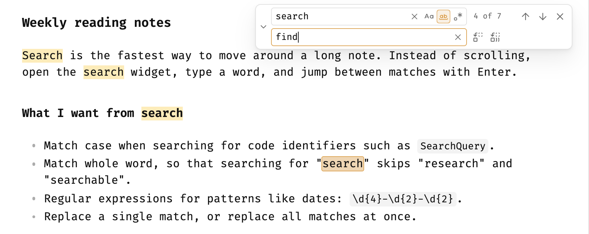

# VSCode Search

[中文 README](README_zh.md)

A VS Code style find and replace widget for the Obsidian editor.



Based on [Enhanced search and replace](https://github.com/liuhaoxd/obsidian-enhanced-search-replace) by Liu Hao (Apache-2.0).

## Features

- **Floating widget** in the top-right corner of the editor, like VS Code. It overlays the note instead of pushing the text down.
- Match case, match whole word and regular expression toggles inside the search box.
- Collapsible replace row (the chevron on the left), with replace and replace all.
- Highlights all matches and shows `n of total`.
- **VS Code keybindings** while the editor or the widget is focused (see below).
- **Works in reading view**: the note switches to editing view while the widget is open and switches back when it closes. Text selected in reading view pre-fills the search box.
- Vim mode aware: `Esc` in insert or visual mode goes to Vim first; `Esc` in normal mode closes the widget.

## Commands

Bind them in **Settings → Hotkeys** (search for `VSCode Search`):

| Command | Suggested hotkey (macOS) |
| --- | --- |
| `Find` | `Cmd+F` (replaces **Search current file**) |
| `Find and replace` | `Alt+Cmd+F` (replaces **Search & replace current file**) |
| `Find next` / `Find previous` | optional |
| `Toggle match case` / `Toggle match whole word` / `Toggle use regular expression` | optional |

On Windows / Linux, use `Ctrl+F` and `Ctrl+H`.

Remove the built-in binding when you assign the same key, otherwise Obsidian runs whichever command it finds first.

## Built-in VS Code keybindings

These work without any setup while the widget is open and the focus is in the editor or the widget. In that situation they take precedence over global hotkeys on the same keys (for example `Cmd+G` → **Open graph view**). Everywhere else, the global hotkeys are untouched.

| Action | macOS | Windows / Linux |
| --- | --- | --- |
| Next match | `Enter`, `Cmd+G`, `F3` | `Enter`, `F3` |
| Previous match | `Shift+Enter`, `Shift+Cmd+G`, `Shift+F3` | `Shift+Enter`, `Shift+F3` |
| Toggle match case | `Alt+Cmd+C` | `Alt+C` |
| Toggle match whole word | `Alt+Cmd+W` | `Alt+W` |
| Toggle regular expression | `Alt+Cmd+R` | `Alt+R` |
| Replace (replace row open) | `Shift+Cmd+1` | `Shift+Ctrl+1` |
| Replace all (replace row open) | `Alt+Cmd+Enter` | `Alt+Ctrl+Enter` |
| Close | `Esc` | `Esc` |

Behaviour that matches VS Code:

- Running **Find** again while the widget is open moves the focus back to the search box.
- **Find and replace** with a search term focuses the replace box.
- **Find next** / **Find previous** open the widget pre-filled with the selection when it is closed.
- When the selected text is a match, it is the current match.

## Install (manual)

Copy `main.js`, `manifest.json` and `styles.css` to `<Vault>/.obsidian/plugins/vscode-search/`, then enable **VSCode Search** in **Settings → Community plugins**.

## Development

```bash
npm install
npm run dev     # watch
npm run build   # type check + production build
npm run lint
```

Releases are built by GitHub Actions with build provenance attestations. Bump the version with `npm version x.y.z`, then `git push --follow-tags`.

## License

Apache-2.0. This project is a modified version of Enhanced search and replace; see [LICENSE](LICENSE) and [NOTICE](NOTICE).
